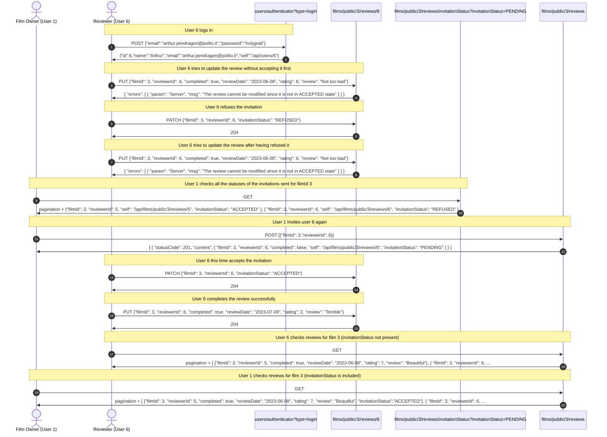

[](https://classroom.github.com/a/rYHqgQ8K)
# Exam Call 3

# Folders Structure
The structure of this repository is the following:
  - "JSON Schemas" contains the design of the JSON Schemas.
  - "REST APIs Design" contains the full Open API documentation of the REST APIs (both in .json and .yaml format) and a Postman collection with a complete example of invocations of the API operations.
  - "REST APIs Implementation" contains the code of the Film Manager service application.

# How to run the server
```shell
git clone git@github.com:polito-DSP-2022-23/exam-call-3-b3xul.git
cd exam-call-3-b3xul/REST\ APIs\ Implementation/
npm install
npm start
```

# Main use cases
To execute the following workflow, just import into Postman the file `REST APIs Design/ExamFilmManager Main Use Cases Run.postman_collection.json` and run the collection.

Each request includes a pre-request script that stores its own expected response in an environment variable. These responses are then compared with the responses actually received using a Test script common for all requests.

In the first run of the collection all tests should pass.
If the collection is run again, since the status of the database changed, some tests won't pass anymore, because instead of the expected response now the appropriate error messages will be returned.

To restore the inital database status it is sufficient to manually delete reviews with (filmId=3,reviewerId=5) and (filmId=3,reviewerId=6) from the database.

The file `REST APIs Design/ExamFilmManager Additional requests.postman_collection.json` contains a second Postman collection with more operations invocations, to show how the requirements where satisfied, and the handling of some errors.

## workflow

## continuation

# Design choices and modifications

## Invitation mechanism
I decided to associate the status of the review invitation to the review itself, by adding an additional enum field to the review table in the database. It only accepts 3 statuses: "PENDING", "ACCEPTED" and "REFUSED".

For this reason, since the invitationStatus is another field of the "review" resource, I used the same endpoint used for updating the full review (/api/films/public/{filmId}/reviews/{reviewerId}), with the PATCH HTTP method, typically used for partially updating a resource.

The PUT logic was updated since now the user needs to request a PATCH of the review, accepting it, in order to be allowed to complete it.

The DELETE logic was updated to avoid deleting reviews that were already ACCEPTED, instead of completed.

## Refused invitations
I decided to avoid keeping an history of all the past invitations because it would use a lot of space without providing particular benefits in my opinion. In fact, to satisfy the requirement of being able to invite again reviewers that previously refused an invitation, only the previous invitation status is required.

## Invitations status visibility

I decided to provide an high amount of flexibility so that the frontend would be able to organize the page as it prefers. For this reason, I designed 3 different review schemas:
- review_schema_full, which contains all the information about the review, including the invitation status;
- review_schema_public, which contains all the information about the review, except for the invitation status. This is what an unlogged user, or a user which is neither the film owner nor the reviewer, would be able to see;
- review_schema_invitationStatus, which only contains the mandatory review fields: filmId, reviewerId and the invitation status. This can be useful if the frontend is only interested in those information instead of all the information about the review;

I implemented internal logic so that the film owner is able to see the invitation status of all reviews for its films and the reviewer is only able to see the invitation status for the films that it has been invited to review.

### Film owner
| endpoint                                                             | view                                  |
| -------------------------------------------------------------------- | ------------------------------------- |
| GET /api/films/public/{filmId}/reviews                               | array(review_schema_full)             |
| GET /api/films/public/{filmId}/reviews/{reviewerId}                  | review_schema_full                    |
| GET /api/films/public/{filmId}/reviews/invitationStatus              | array(review_schema_invitationStatus) |
| GET /api/films/public/{filmId}/reviews/{reviewerId}/invitationStatus | review_schema_invitationStatus        |


### Reviewer
| endpoint                                                             | view                           |
| -------------------------------------------------------------------- | ------------------------------ |
| GET /api/films/public/{filmId}/reviews                               | array(review_schema_public)    |
| GET /api/films/public/{filmId}/reviews/{reviewerId}                  | review_schema_full             |
| GET /api/films/public/{filmId}/reviews/invitationStatus              | unauthorized                   |
| GET /api/films/public/{filmId}/reviews/{reviewerId}/invitationStatus | review_schema_invitationStatus |

### Unlogged user
| endpoint                                                             | view                        |
| -------------------------------------------------------------------- | --------------------------- |
| GET /api/films/public/{filmId}/reviews                               | array(review_schema_public) |
| GET /api/films/public/{filmId}/reviews/{reviewerId}                  | review_schema_public        |
| GET /api/films/public/{filmId}/reviews/invitationStatus              | unauthorized                |
| GET /api/films/public/{filmId}/reviews/{reviewerId}/invitationStatus | unauthorized                |

## Pagination mechanism

I changed the pagination mechanism to avoid duplicate db query when counting films/reviews.
This affects GET operations on endpoints /api/films/public, /api/films/private, /api/films/invited, /api/films/public/{filmId}/reviews, /api/films/public/{filmId}/reviews/invitationStatus.

## Filtering information
I implemented a filtering mechanism based on the `invitationStatus` query parameter for /api/films/public/{filmId}/reviews and /api/films/public/{filmId}/reviews/invitationStatus. This allows the film owner to filter the reviews by their invitation status, selecting only the information that he really wants to retrieve.

I also added this mechanism to /api/films/public/invited. This allows the reviewer to filter the films that he has been invited to review by their invitationStatus.

This also combines with the improved pagination mechanism to limit the amount of results returned effectively.

## Reviews issuing
I created an additional review_schema_post_array schema to validate the body of the POST /api/films/public/{filmId}/reviews request.
In this way only the mandatory fields of a review are sent during the post operation (filmId and reviewerId). This allows to minimize the size of the messages in transit, since other fields would not be used in the issuing operation.

Moreover, I decided to improve the issuing of multiple reviews by using HTTP status code 207: Multi-Status. It is used to indicate that the response contains multiple status codes, each related to a different resource within the request. In this way if some reviews were correctly issued while others were not, the client has a detailed breakthrough of which ones succeeded and which ones failed.

## Request body validation
By creating different review schemas for the different endpoint, I was able to validate all requests bodies using the express-json-validator-middleware:

| Operation                                             | Body validation schema         |
| ----------------------------------------------------- | ------------------------------ |
| POST /api/films/public/{filmId}/reviews               | review_schema_post_array       |
| PUT /api/films/public/{filmId}/reviews/{reviewerId}   | review_schema_public           |
| PATCH /api/films/public/{filmId}/reviews/{reviewerId} | review_schema_invitationStatus |
